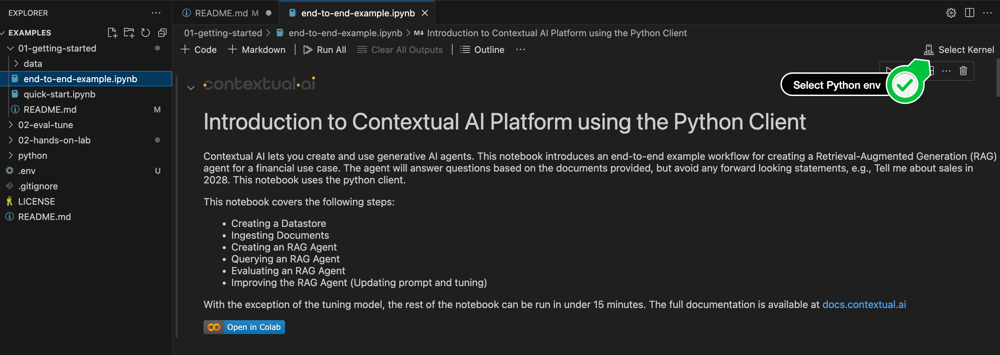

# Contextual AI Platform Intro Examples


This repository contains example notebooks demonstrating how to use the Contextual AI Platform for creating and deploying generative AI agents. The examples focus on implementing Retrieval-Augmented Generation (RAG) for financial use cases.

## Repository Structure

This repository includes two implementation approaches:
- [Quick-start.ipynb](quick-start.ipynb): Get started fast!
- [End-to-end-example.ipynb](end-to-end-example.ipynb): A complete walkthrough of a use case from creation to tuning.

The examples can be completed in under 15 minutes (excluding model tuning). Each notebook is self-contained and includes detailed explanations for each step.

For comprehensive platform documentation, visit [docs.contextual.ai](https://docs.contextual.ai/)

### Prerequisites

- Contextual AI Platform access
- Python 3.8+
- Python client `pip install --pre contextual-client`

### API Key

To use the notebooks, you will need an API key to securely access the API. To generate an API key, your admin can follow the process below:

1.   Log into your tenant at app.contextual.ai
2.   Click on "API Keys"
3.   Click on "Create API Key"
4.   Please keep your key in a secure place, and do not share it with anyone


## Use Case

These examples focus on creating a financial RAG agent that:
- Answers questions based on provided documents
- Avoids making forward-looking statements
- Handles financial data responsibly
- Provides accurate, document-based responses

Three data files are used in these notebooks, an ingested document, evaluation dataset, and a training dataset. These are toy datasets to illustrate the functionality of the platform.

- **Ingestion:** `Apple.pdf`

- **Evaluation:** `eval_short.csv`

- **Training:** `fin_train.jsonl`

## 🚀 Getting Started

To quickly get started running the notebook we reccomend using [Google Colab](https://colab.research.google.com/). If you'd prefer to run it locally, you can run in VS Code following these steps:

1. 📥 Clone this repository
    ```bash
    git clone https://github.com/ContextualAI/examples
    cd examples/
    ```

2. 🌎 Create a virtual environment:

    ```bash
    python -m venv . && source bin/activate
    ```

3. 📦 Install required dependencies
    ```bash
    pip install -r requirements.txt
    ```
4. 🎮  Open the notebook in VS Code, click on "Select Kernel" (top right) -> "Python Environments" and select the newly created `venv` environment:


    

5. 🔑 Set up your API credentials in the respective [notebook](01-getting-started/end-to-end-example.ipynb)
    ```bash
    API_TOKEN = '...'  # Replace with your actual API token
    ```
