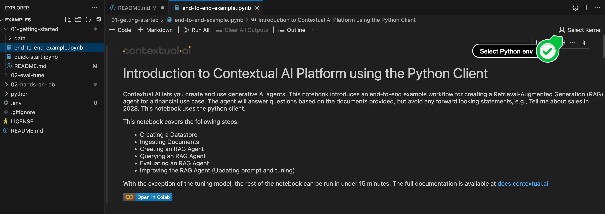

<br/>

## Hands-on Lab: Creating a Specialized RAG Agent

Contextual AI lets you create and run specialized AI agents that are powered by your data. These notebooks introduce an end-to-end example workflow for creating a Retrieval-Augmented Generation (RAG) agent for a financial use case. The agent will answer questions based on the documents provided, but avoid any forward looking statements, e.g., Tell me about sales in 2028. 

The full documentation is available at [docs.contextual.ai](https://docs.contextual.ai/)

You can go through this lab in 30-60 minutes and covers the following topics:

### Lab 1: Creating the Datastore and Agent

In this lab you will learn how to:

  - Creating a Datastore: this is where your documents live (unstructured data)
  - Ingesting Documents: we will use a single PDF document but the platform is fully scalable and supports HTML among other formats
  - Creating an RAG Agent: all you need is a good system prompt to get started
  - Query a RAG Agent: answers based on your data and nothing more

### Lab 2: Evaluating the RAG Agent

  - Evaluate the accuracy using a sample eval set

### Lab 3: Improving the RAG Agent using:
  - Prompt engineering
  - Fine-tuning

## Prerequisites:

- API key. You can request one [here](https://contextual.ai/platform/).

- We will share the key with you or you will have to:
 
    1. Login to your account at [app.contextual.ai](app.contextual.ai)
    2. Click on "API Keys"
    3. Click on "Create API Key". *Note: Please keep your key in a secure place, and do not share it with anyone*

- Python 3.9+

## 🚀 Getting Started

To quickly get started running the notebook we reccomend using [Google Colab](https://colab.research.google.com/). If you'd prefer to run it locally, you can run in VS Code following these steps:

1. 📥 Clone this repository
    ```bash
    git clone https://github.com/ContextualAI/examples
    cd examples/02-hands-on-lab/
    ```

2. 🌎 Create a virtual environment:

    ```bash
    python -m venv . && source bin/activate
    ```

3. 📦 Install required dependencies
    ```bash
    pip install -r requirements.txt
    ```
4. 🎮  Open the notebook in VS Code, click on "Select Kernel" (top right) -> "Python Environments" and select the newly created `venv` environment:


    

5. 🔑 Set up your API credentials in the respective [notebook](01-getting-started/end-to-end-example.ipynb)
    ```bash
    API_TOKEN = '...'  # Replace with your actual API token
    ```